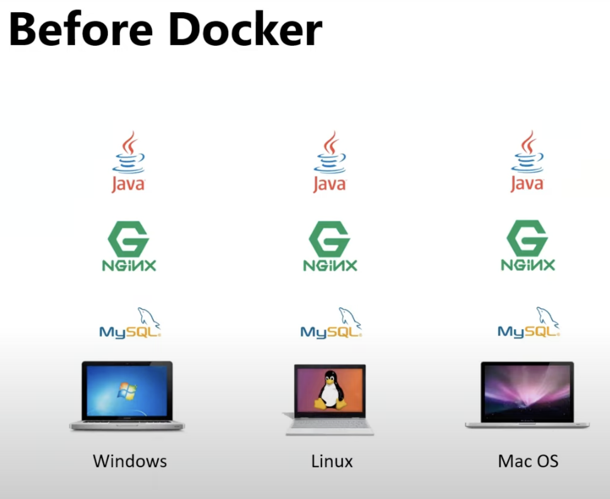
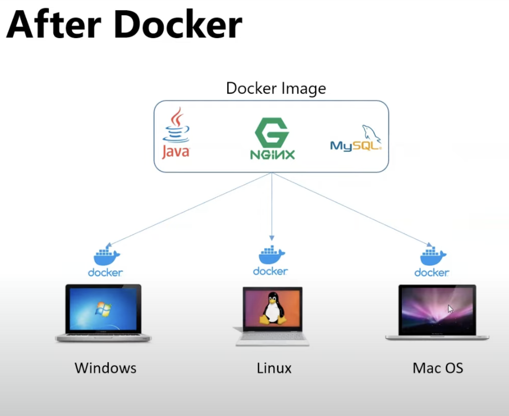
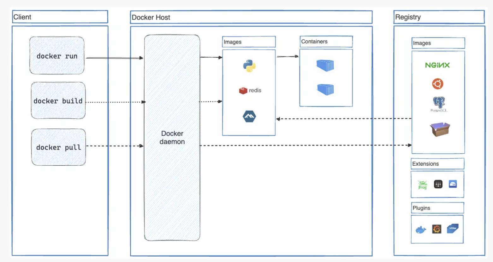

## Docker

It is a platform, or an engine that we can install in our laptop or production server.

soft devlopers writes the code ryt, that code is abstracted and creates that into package and store that as a image, using that images light weight machines are runned.

Virtual machines are heavy weight. we nedd to install entire os. when we create
 virtual machine, irrespective of the need of the os , we need to install it. 

 we get the compatability issues if we use the virtual machines. 

 when we install docer, same like virtual machine we will run the containers, they are light weight. 

 becoz of docker engine all the containers are working. resolves the compatiblity

when we install the docker desktop app, we can create the contaners,

> we actually use the docker images to create the containers, it containss the preconfigured envronments and set of instructions which is useful to run on desktop app

docker

docker images --> gives the list of images we have previously

docker pull nginx--> it is an image we are pulling into our apllication

docker ps -->list all the running Docker containers 

docker inspect image localstack --> gives the information about the image

### docker images are the read-only templates 

> When we pull this image it creates the **writable layer**, there we can store all the tables or whatever we write. 

> If we restart te coontainer we will be losing the data

# DynamoDB
DynamoDB is a fully managed NoSQL database service provided by Amazon Web Services (AWS). 

It is designed to handle large amounts of data and provide fast, predictable performance with seamless scalability. 

It requires only a primary key and doesn’t require a schema to create a table.

### Key Features of DynamoDB

NoSQL Database:

DynamoDB is a NoSQL database, meaning it does not use the traditional relational database model with tables, rows, and columns. Instead, it stores data in flexible, JSON-like documents with attributes that can vary between items.

Key-Value and Document Store:

It primarily operates as a key-value store where each item (or record) is identified by a unique key. It also supports document data models, allowing for complex data structures like JSON to be stored and queried.

Fully Managed:

DynamoDB is fully managed by AWS, meaning that AWS handles tasks like hardware provisioning, software patching, setup, configuration, and backups, so you don't have to.

Scalability:

DynamoDB automatically scales to handle the capacity you need, from small workloads to massive applications. It can scale horizontally by distributing data across multiple servers to handle large amounts of traffic and data.

DynamoDB comprises of **three fundamental units** known as table, attribute, and items.

Table, Items, and Attributes

A **table** can be visualized as a group of items. Taking an example of Employee records, you will have Employee Name, Employee ID, Address and Phone Number all such items will be stored in a table.

An **item** is a set of attributes in a table. You can also understand an item as a set of attributes that can uniquely define your entry in a table. For example, an item in Employee records will identify a single employee.

An **attribute** is a single field that is attached to an item. E.g. Employee Name.

### Example of How DynamoDB Works

Imagine you are building an e-commerce website. You might use DynamoDB to store information about products, where each product is an item in the database. Each item might have attributes like ProductID (the key), Name, Price, and Category. DynamoDB allows you to quickly retrieve any product by its ProductID, and it scales easily as your catalog grows.

## SQS

## What is SQS?

SQS is a service that helps you manage messages between different parts of your applications.

AWS SQS is used in backend systems to improve communication between services, manage tasks efficiently, ensure reliability, and handle various operational challenges in a scalable and organized manner.

> Main Uses:
**Decoupling Components:** Connect parts of your system without them needing to talk to each other directly. For example, a web server can put tasks into a queue, and a worker server can process them later.

**Load Balancing:** Smooth out spikes in activity by temporarily storing messages. This way, your system can handle more traffic without getting overwhelmed.

**Background Jobs:** Handle tasks like sending emails or processing data in the background, without making users wait.

**Reliability:** Make sure messages are not lost and are processed even if something goes wrong. Messages stay in the queue until they are successfully handled.

**Scalability:** Automatically handle more messages as your needs grow, without having to manage the infrastructure.

**Workflow Management:** Manage tasks in a specific order by using multiple queues.

Examples:
Order Processing: An online store uses SQS to handle new orders. When an order is placed, it goes into a queue, and a worker processes it later.
Log Collection: Gather logs from different services into a queue for easier management and analysis.

1. Creating a Queue

Sign in to the AWS Management Console and open the SQS console at https://console.aws.amazon.com/sqs/.

Click on "Create queue" to start the setup process.

Choose the type of queue:

Standard Queue: Offers high throughput and at-least-once delivery. It's suitable for most applications.

FIFO Queue: Ensures that messages are processed exactly once and in the exact order that they are sent. Use this for applications requiring strict ordering and deduplication.

 Configure the queue:

Queue Name: Provide a unique name for your queue.

### Configure Queue Settings:

 Set options such as message retention period, visibility timeout, and delivery delay.
Set up access permissions:

Queue Policies: Define who can send messages to or receive messages from the queue using IAM policies or resource-based policies.
Review and create:

Review your settings and click "Create Queue."

2. Configuring Queue Attributes

You can customize various attributes of your SQS queue to suit your needs:

**Message Retention Period:** Time in seconds that SQS retains a message. The default is 4 days, but it can be set from 60 seconds to 14 days.

**Visibility Timeout:** Duration that a message remains invisible after being picked up by a consumer. The default is 30 seconds, and it can be set from 0 to 12 hours.

**Message Delay:** Time to delay the delivery of messages to the queue. This can be set from 0 to 15 minutes.

**Maximum Message Size**: Maximum size of a message. The default is 256 KB, but can be set up to 2 GB with extended messages.

**Receive Message Wait Time:** Used for long polling. Sets how long the ReceiveMessage action waits for a message to become available before returning.

3. Queue Security

Access Control: Use IAM roles and policies to control who can send and receive messages from your queues.

Encryption: Enable server-side encryption (SSE) to protect the content of your messages at rest.

4. Monitoring and Metrics

CloudWatch Metrics: Monitor the queue using Amazon CloudWatch metrics, which include metrics such as the number of messages sent, received, and deleted.

CloudWatch Alarms: Set up alarms based on these metrics to alert you to issues or take automated actions.

5. Integrating with Other AWS Services

Lambda Functions: You can trigger AWS Lambda functions to process messages from the queue automatically.

SNS: Combine SQS with Amazon SNS (Simple Notification Service) for pub/sub messaging scenarios.

6. Handling Dead-Letter Queues

Dead-Letter Queue (DLQ): Configure a DLQ to handle messages that can't be processed successfully after a specified number of attempts. This helps you debug and manage problematic messages.

7. Testing and Debugging
Send and Receive Messages: Use the AWS Management Console or AWS SDKs to send and receive test messages to ensure your queue is functioning as expected.
By configuring SQS properly, you can ensure reliable, scalable, and secure message handling for your applications.

### overview of how to configure an SQS (Simple Queue Service) queue in AWS:

1. Create a Queue
Sign In: Go to the AWS Management Console and open the SQS service.
Create Queue: Click on "Create queue."
Queue Type: Choose between Standard (for general use) or FIFO (for ordered, exactly-once processing).
Queue Name: Enter a name for your queue.
Settings: Configure basic options like message retention time and visibility timeout.

2. Set Permissions
Access Control: Set who can send messages to or receive messages from your queue using IAM roles or policies.

3. Optional Settings
Encryption: Enable if you need to secure your messages.
Dead-Letter Queue: Set up if you want to handle messages that fail to process after several attempts.

4. Monitor and Test
Monitor: Use CloudWatch to keep an eye on metrics like message counts.
Test: Send and receive messages to make sure everything works.
That’s it! You now have a basic setup for an SQS queue.

## visibility timeout

So when the message is in the queue, and there are several consumers. If once this message is read by one of the consumer, then it is not visible to other consumers. In that visibility timeout, the message should be processed and deleted, if not done so that message will be visible again for the other consumers.

## Delivery delay

So whenever you want to shedule the tasks which should be executed first or at a specific time i n the future, we can set a delay time when they can be visible for the processing

 Delivery Delay is the period you set to delay the delivery of a message to the queue after it has been sent. During this delay period, the message is stored in the queue but is not visible to consumers until the delay period expires.

 ## Serverless Computing

Serverless is a service where you do not have to think about servers.

With serverless, you only have to think about code.

The cloud provider handles all infrastructure behind it.

AWS has a serverless service called AWS Lambda.

## How AWS Lambda Works

Deploy your code to Lambda

Make the code ready to trigger an event

The code only runs when triggered

Pay only when your code is running

You only used fuel when driving.
Lambda works in the same way. The use is on-demand when you run the code.

> AWS Lambda can be used to:

Build and deploy apps

Monitor and maintain apps

## SQS CLI

brew install awscli

aws configure

To create a new SQS queue, use the following command:

aws sqs create-queue --queue-name my-queue

To list all SQS queues in your account:

aws sqs list-queues

To send a message to your SQS queue:

aws sqs send-message --queue-url <your-queue-url> --message-body "This is a test message"

Replace <your-queue-url> with the URL of your SQS queue.

To receive messages from your SQS queue:

aws sqs receive-message --queue-url <your-queue-url>

Delete Messages from the Queue:

aws sqs delete-message --queue-url <your-queue-url> --receipt-handle <receipt-handle>
