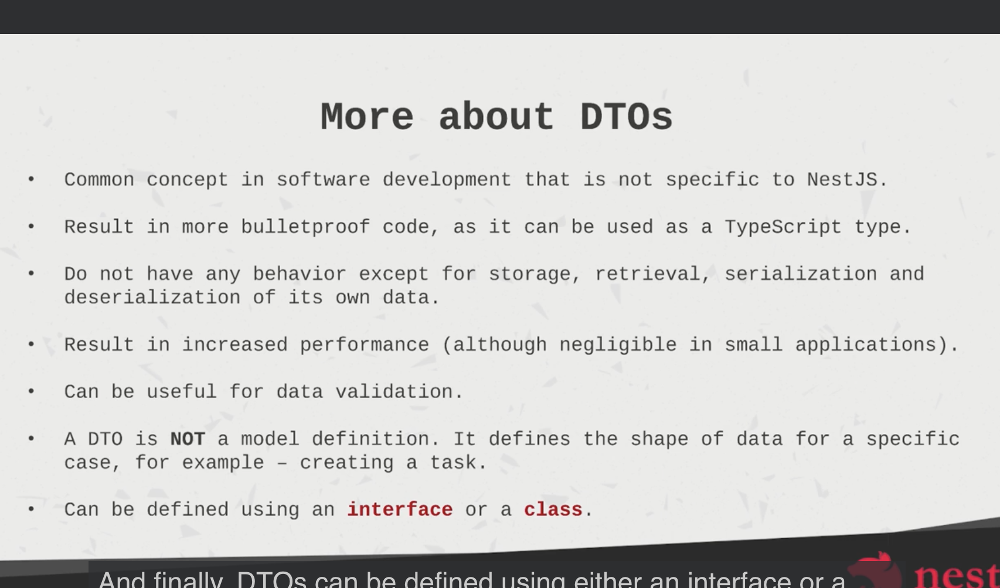
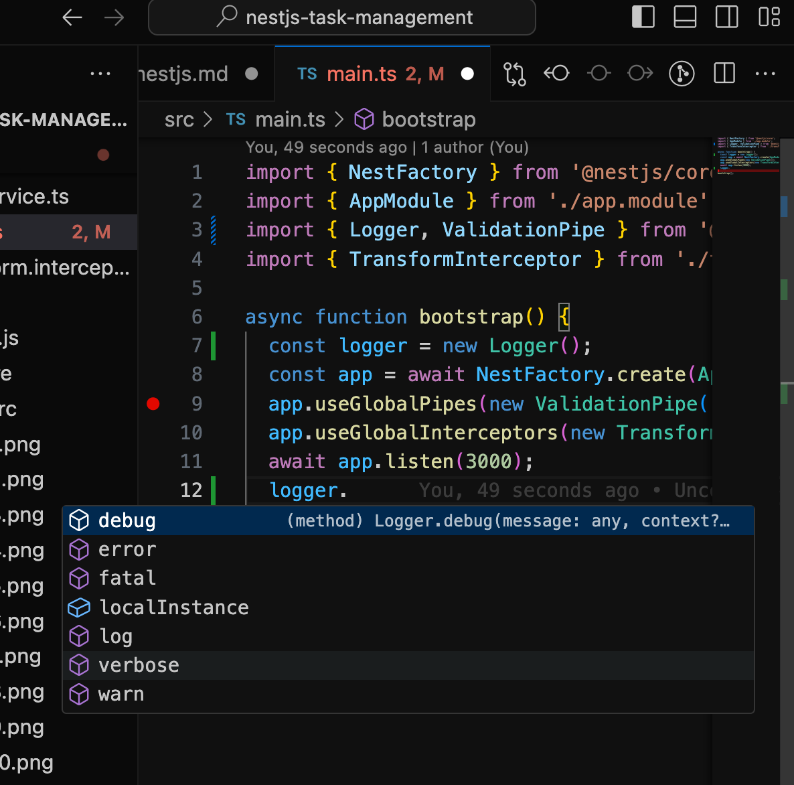

**AppModule** is the root module of the application, crucial role in organizing and initializing the application.

**NestJS CLI (Command Line Interface)** provides commands to automate common tasks like creating modules, controllers, services, and more

### Key Features of the NestJS CLI


1. **Project Creation**: Quickly scaffold a new NestJS project with a standard structure.
2. **Code Generation**: Automatically generate modules, controllers, services, and other components.
3. **Development Server**: Run a local development server with live reloading.
4. **Build and Testing**: Facilitate building and testing of the application.
5. **Configuration**: Manage configuration for different environments and setups.

## Files which may be deleted if not in use are

src/app.controller.ts: Remove if not using default controller.

src/app.service.ts: Remove if not using default service.

src/app.controller.spec.ts: Remove if not writing tests.

src/app.service.spec.ts: Remove if not writing tests.

test/app.e2e-spec.ts: Remove if not using end-to-end tests.

test/jest-e2e.json: Remove if not using Jest for end-to-end testing.

nest-cli.json: Remove if not using CLI configuration.

## NestJS modules

1. Each application must contain atleast one module, maybe root or anyother

2. The modules are singletons. i.e these modules can be imported by other modules.


@Module Decorator props

1. Providers 
2. Decorators
3. Imports
4. Exports

## Dependency Injection

Instead of a class (like a car) creating its own dependencies (like the key), you provide those dependencies from outside. This makes the code cleaner and easier to manage.

## Decorators
Decorators are the special kind of function and it can be attached to any methods, classes objects, The decorator can modify their behaviour and even it can add the meta data

## Controller

It is a class which is annotated with the @controller decorator.

Actions have methods. 

Job of the controller is to create the endpoints. 

It controls the process of handling the requests.

Responsible for recieving incoming requests and returning a response

## Providers.

Most of the code is written in the providers.

A provider is a class that can be injected into other classes. Providers can include services, repositories, factories, and more.

1. Defining a Provider

To define a provider, you create a class and use the @Injectable() decorator to mark it as injectable.

2. Registering a Provider

Providers must be registered in a module so that they can be injected where needed. This is done in the providers array of a module.

3. Injecting Providers

To use a provider in another component (like a controller or another service), you inject it through the constructor of that class.

## Handlers

Handlers are the emthods within the controller class

@post, @get @delete etc


## What is a service?

Services are implemented using the providers.

We will be importing the services in the providers.

Services can be imported into the controllers to call the methods also.

### In the app module.ts we need to  import the service class in the providers, not the controllers


### Service class will own the business logic and interact with databases or external APIs, controller will be the entrypoint, it communicate with the service and return the result.


A method is just a function in class

The names of the method can be same or different in the controller and the service classes.

We cannnot do everything in the controller, because the if the business logics are more , going on using the service for the business logic will be easier. 


here we canot assign it as value, so we have to give the defaiult types in the method as parameters. like

```ts
  CreateTask(title: string, description: string): Task {
    const task: Task = {
      id: '',
      title,
      description,
      status: TaskStatus.OPEN,
    };
  }
```
Here we gave it as default type so that we can use the title and description as the values.

Using the postman to  get  the task dat.

Post method is reated and used the  post method which was in service in the controller using the **@post** handler.

## DTO(Data transfer Object)

The Http request is been generated, the request then goes to the controller body prameters are extracted, then we call crateTask method, then this method andles those arguments


A DtO is the object which carries data between the processes. 

It is an object that defines how the data will be sent over the network.

**Serialization** is the process of converting an object or data structure into a format that can be easily stored, transmitted.JSON, XML, and binary etc 

```ts
JSON.stringify()
``` 
converts the task object into a JSON string

**Deserialization** is the reverse process of serialization. It involves converting serialized data (e.g., a JSON string) back into its original object or data structure.

```ts
JSON.parse()
``` 
converts the JSON string back into a JavaScript object.




- Use only classes for the DTO because interfaces are the  part of the ts and they are not prserved after the compilation.


- We cannot use a Dto when we are fetching the data. We need the seperate dtos for every parameter we are fetching, it becomes the complex

## NestJs Pipes

used for transforming and validating data in request handlers. They can be used to perform operations such as data validation.


The ValidationPipe is commonly used with DTOs (Data Transfer Objects) and class-validator decorators to validate incoming request data.

Applying Pipes: Pipes can be applied at the route handler level, controller level, or globally.


Built-in Pipes: NestJS includes several built-in pipes like ValidationPipe, ParseIntPipe, and ParseUUIDPipe.

## What is ORM?

**Object-Relational Mapping (ORM)** is a technique that allows you to **interact with a database using objects** instead of writing raw SQL queries. It makes working with databases more intuitive by mapping database tables to classes in your code.

### Entities

Entities are used in conjunction with an ORM (Object-Relational Mapping) tool to represent and interact with database tables.

- An entity is a class that maps to a database table. Each instance of the entity class corresponds to a row in the table.

- The properties of the entity class represent the columns of the database table.

- Entities use decorators to define metadata about the database schema, such as primary keys, column types, and relationships.

## Active Record and Data Mapper

Two design patterns used in object-relational mapping (ORM)

- Both patterns help in mapping database tables to objects, but they handle this mapping in different ways.

Active Record:

Combines data and behavior (CRUD operations) in one class.

Simpler for small applications but can become cumbersome in larger applications.

Data Mapper:

Separates data and behavior into different classes.

More flexible and scalable, especially for complex applications.


## Active Record vs. Data Mapper

| Feature              | Active Record                                      | Data Mapper                                      |
|----------------------|-----------------------------------------------------|--------------------------------------------------|
| **What It Is**       | Combines data and database operations in one class | Keeps data and database operations separate      |
| **Class Role**       | The class does its own database work               | The class only holds data; a separate class does the database work |
| **How It Works**     | The object knows how to save, update, or delete itself | The object doesn’t handle database work; a mapper class does  |
| **Code Structure**   | Simple and straightforward, all in one class       | More organized, with separate classes for data and database handling |
| **When to Use**      | Good for simpler apps                              | Better for complex apps with more sophisticated data needs |


When we used the typeORM in the app.module we used **forroot**

And when we are using the TypeORM in the tasks.module we are using the **forfeature**

Its like for the root module and the sub modules

## Interacting with the database.

Commented out all the emthods in th econtroller and the service as we are goin to implemeny them using the persistance i.e Data persistence means that data is stored in a way that it remains available and intact even after the application or system that created it has ended or restarted.


We are going to store them in the database


- Whenever we are interacting with the data base it is an async operation so we will be defining the methods as a async methods.

```ts
async getTaskById(id:string):promise<Task>{
  
}
```

we are telling the type script that thus method is going to return a promise object

[# typeorm methods](https://typeorm.io/repository-api)

```ts
  async CreateTask(CreateTaskDto: CreateTaskDto): Promise<HeyTask> {
    const { title, description } = CreateTaskDto;
    const task = this.tasksRepository.create({
      title,
      description,
      status: TaskStatus.OPEN,
    });
    await this.tasksRepository.save(task);
    return task;
  }
```

Here instead of push in the previous methods. We actually save them into the database using await this.tasksRepository.save(task); this line.

- database operations are asynhronous. If we dont use await on the database operation, code will not work

### Delete functonality

We can use delete and remove , both are same in the functionality  ut it is different how we call them

> When we use delete it takes the id, or arrays of id or the object to delete, it doesnt check whether the id is present in the database or not. 

```ts
await repository.delete(1)
await repository.delete([1, 2, 3])
await repository.delete({ firstName: "Timber" })

```
## Introduction to authentication and authorization


> Auth part1
## Storing the passwords securely

We will be using hashing

Hash is a one way function--> If we give the same input it always gives the same output

Once hashing has been done, it should be impossible to go from the output to the input.

Hash value cannot be decrypted

## How we validate this password? 🤔

The user goes into frontend and signin and we get the the password which they typed. We will run it through the same hashing function to output a hash, and we compare that hash with the hash that has been stored in the database. If they match then the pasword is correct.

> So when we verify the password, you dont decrypt the existing one, we just try to reproduce the correct password using users input.

## Problem1 😳

As we know hash is the one way function, if any other user gives the same password, ot stores that password with the same hash name which was given to us in the database.

## Problem2 😳


If somebody attacks and gets ino the db and can read the hash value, they simply go to the rainbow table which shows or which maps the password with the hash value

## Solution 😁
 
- SALT
 means 'demonstrate'


somesalt_password--> here in the place of somesalt it prefixes the random number and then it stores. It prefixes the password with some random number.


Libraries which can help protect the passwords is `Bcrypt`

Bcrypt will store the unique salt per password

## JSON Web tokens (JWT)
## What is JWT?

JWT stands for JSON Web Token. It’s a way to securely transmit information between parties as a JSON object. It's commonly used for authentication and information exchange.

### How Does JWT Work?
**JWT Structure:**

A JWT is composed of three parts:

**Header**: Contains information about how the token is encoded.

**Payload**: Contains the data you want to transmit (like user information or claims).

**Signature**: Ensures the token hasn’t been altered.

**header.payload.signature**


JWT's can be decoded by anyone and they should not contain any sensitive information


We are going to use the Passsport JS which is the authentication middleware for the Node.js it supports multiple strategies and one of the strategy is JWT


#### command

```ts
yarn add @nestjs/jwt @nestjs/passport passp
ort passport-jwt
```
add the following imports into the auth module
```ts
@Module({
  imports: [
    PassportModule.register({ defaultStrategy: 'jwt' }),
    JwtModule.register({
      secret: 'topsecret18',
      signOptions: { expiresIn: 3600 },
    }),
```


we can give the return type like this
```ts
  async signIn(
    AuthCredentialsDTO: AuthCredentialsDTO,
  ): Promise<{ accessToken: string }>
```
[Jwt accesstoken decoder](https://jwt.io/)


```ts
{
  "username": "pawankalyan",
  "iat": 1723033438,
  "exp": 1723037038
}

iat :issued at
Timestamp: It provides a timestamp for when the token was issued.

exp (expiration) claim is crucial for managing token lifespan.
```

command 

yarn add @types/passport-jwt

gives the type to use the typescript integrating with passport jwt easier

In Jwt.strategy.ts we have added a class
. And it is a derived class. Jwt strategy is derived from passport strategy .
If there is a constructor in the derived class they need to call `super` to initialize the parent class


> Summary on JWT validation

- Whenever we want to protect the routes for only the signed in users, we will be able to import the auth module and then use the guard. CCORDINGLY THE ROUTES WILL BE PROTECTED AND WHEN THE AUTHORIZED USED SENDS A REQUEST WE WILL BE ABLE TO GET THEM and we treat it as truth.


@GetUser Decorator is created for that particular request to go into that decorator and that will be handling that request.

Finally **Guarding the tasks** is done by importing the authmodule into the providers of the tasks module and in the controller use the **@USEGuards(AuthGuard( ))** decorator


> Auth Part 2

Tasks and users -> Database relation

## Relation

When you have a relation, one of the sides of that relation can be eager. When it is set to true here it is for "User", whenever we fetch the user we are going to fetch the tasks as well , no need of manually doing it

Here we want to connect the users to the tasks 


> This is the usersEntity
```ts
@OneToMany((_types) => HeyTask, (task) => task.User, { eager: true })
  tasks: HeyTask[];
```
> This is the Task entity.ts

```ts
  @ManyToOne((_types) => UsersEntity, (User) => User.tasks, { eager: false })
  User: UsersEntity[];
```
here anyone can see the username and password if they fetch so we need to serialize.
```ts
{
    "title": "hey all",
    "description": "my name is neha",
    "status": "Open",
    "user": {
        "id": "9515037f-dc00-4a45-86cd-e08e7595b148",
        "username": "user5",
        "password": "$2b$10$mYUC7b5Fhu4pXbWd6qtA9Oz9/94dIQPtD9AEUE09TLTSFvLVbFc4O",
        "tasks": []
    },
    "id": "c99b2d3d-fdb4-424f-9008-e158e81600c8"}
```

### Eager Loading (eager: true)

The **eager** option in TypeORM is used to control whether a related entity (in a ManyToOne, OneToMany, OneToOne, or ManyToMany relationship) should be automatically loaded when the main entity is queried from the database.


When eager is set to true, TypeORM will automatically load the related entity every time the main entity is queried.


> If you fetch a HeyTask entity, the associated user will be automatically included in the response.
```sql
SELECT * FROM hey_task 
LEFT JOIN users_entity ON hey_task.user_id = users_entity.id
```
### Lazy Loading (eager: false)

When **eager** is set to false (which is the default behavior), TypeORM does not automatically load the related entity. Instead, you must explicitly request the related data when querying the main entity.


## How the GetUser Decorator Works

The GetUser decorator in NestJS is a simple, reusable way to get the authenticated user's information from the request in your controller methods. 


1. User Authentication:

When a user makes a request to a protected route, the JWT token is verified by the JwtAuthGuard.

If the token is valid, the JwtStrategy retrieves the user from the database and attaches it to the request object.

2. Decorator Usage:

The @GetUser() decorator in the controller method extracts the user from the request object.

This user object is then available as a parameter in the controller method, allowing you to easily access user details.

3. Controller Logic:

You can then use this user object to perform operations, such as associating a task with the user or verifying user permissions.


> **Debugging Tip**

If you find that the user is undefined when you use the @GetUser() decorator, you should:

Ensure that the JWT token is being correctly validated and the user is being attached to the request in the 
JwtStrategy.

Add logging in the decorator to verify that the user property is indeed present on the request object.


## Interceptor

It allow us to do somehing like, when a req comes in we can process, change or transfom he data.


we can apply the interceptor at handler level, controller or app level. 

Here we used Exclude(toplaintext:true)
this helps to hide the data which is in the json format or the plain text formAT.


Our nest doesnt know how to use it so we use the interceptors.

Interceptor is created and then we have to import it in the main.ts. using app.global

## Loggers

Why do we need logs?

we are having so many operations in the application, to know whats wrong we use logs, 

**Types:**

1. Log- General purpose
2. Warning- 
3. Error- 
4. Debug- 
5. Verbose-




```ts
async function bootstrap() {
  const logger = new Logger();
  const app = await NestFactory.create(AppModule);
  app.useGlobalPipes(new ValidationPipe());
  app.useGlobalInterceptors(new TransformInterceptor());
  const port = 3000;
  await app.listen(port);
  logger.log(`Application listening on port ${port}`);
}
```

```ts
@Controller('task')
@UseGuards(AuthGuard())
export class TaskController {
  //instantiating the logger
  private logger = new Logger('TaskController');
  constructor(private taskService: TaskService) {}}
```

when we want to print the objet we need to wrap it with json.stringify
```ts
 this.logger.verbose(
      `User ${user.username} retrieving all tasks. Filters: ${JSON.stringify(filterDto)}`,
    );
```


#### As all the controllers, services, repositories are the classes, we can apply the logger as same way like class member

Error property will have stack trace, 


## Configuration

refers to managing and organizing application settings, which might vary across different environments (development, testing, production).

codebase vs Environment variables

You can define the configuration in the codebase. For example, in a config folder.

You an also support values via environment variables which are provided when running the application.


- Whenever you are making any changes in the env files you need to restart the application.

> useFactory is a function in NestJS that allows you to set up something (like a database connection) dynamically, based on certain conditions or values.

> useFactory is used to create the database connection settings based on environment variables. This way, you can easily switch between different environments or configurations without changing the code.


Here in the appmodule you need to do these.
```ts
@Module({
  imports: [
    ConfigModule.forRoot({
      envFilePath: [`.env.stage.dev`],
    }),
    TaskModule,
    TypeOrmModule.forRootAsync({
      imports: [ConfigModule],
      inject: [ConfigService],
      useFactory: async (configService: ConfigService) => {
        return {
          // protocol: 'http:',
          type: 'postgres',
          synchronize: true,
          autoLoadEntities: true,
          entities: [HeyTask],
          host: configService.get('DB_HOST'),
          port: configService.get<number>('DB_PORT'),
          username: configService.get('DB_USERNAME'),
          password: configService.get('DB_PASSWORD'),
          database: configService.get('DB_DATABASE'),
        };
      },
    }),

    AuthModule,
  ],
  controllers: [AppController, TaskController],
  providers: [AppService, TaskService, TasksRepository],
})}
```

## the env.stage.dev is case sensitive and should be in  this format only
```ts

      DB_HOST=localhost
      DB_PORT=5432
      DB_USERNAME=username
      DB_PASSWORD=password
      DB_DATABASE=task-management
```

### schema validation
We need to add the certain packages using the yarn

yarn add  @hapi/joi

then use this command

yarn add -D @types/hapi__joi

Take a new file called config.ts and start with th import of the joi .

Using joi.object we can validate the data


### JWT secretkey configuration

1. In the validation schema add JWT_SECRET: Joi.string().required()
2. Use the secure password generator for the random password copy it
3. in the .env.stage.dev paste the SECRET_KEY = copied value
4. In the auth module import the config module,in jwt stratgy inject the config service 
5. In the jwt strategy we change the value of the secret key to the configservice.get('JWT_SECRET')
6. In the auth module if we want to call the jwt module register, we also call it with the register async. Same process of the usefactory

# Asynchronous (Async)

**Asynchronous Operations:** These operations allow the application to continue executing without waiting for the operation to complete. 

Example: A method or service that performs an HTTP request or accesses a database, returning a Promise or Observable:


```ts
@Injectable()
export class AsyncService {
  async getAsyncData(): Promise<string> {
    return await new Promise((resolve) => {
      setTimeout(() => {
        resolve('This is asynchronous data');
      }, 2000);
    });
  }
}
```
**Usage in Module Configuration:** When dealing with asynchronous operations during module configuration, you might need to use an async factory function:

```ts
@Module({
  imports: [
    ConfigModule.forRootAsync({
      useFactory: async () => {
        const config = await someAsyncFunction();
        return config;
      },
    }),
  ],
})
export class AppModule {}
```
**Asynchronous Module Initialization**: 
 When setting up modules that require asynchronous operations (e.g., connecting to a database, loading configuration), you often use the forRootAsync or similar methods, which accept an async factory to handle the asynchronous nature of the initialization.


```ts
@Module({
  imports: [
    DatabaseModule.forRootAsync({
      useFactory: async () => ({
        type: 'mysql',
        host: process.env.DB_HOST,
        port: parseInt(process.env.DB_PORT, 10),
        username: process.env.DB_USER,
        password: process.env.DB_PASSWORD,
        database: process.env.DB_NAME,
      }),
    }),
  ],
})
export class AppModule {}
```
In summary, "sync" refers to synchronous operations that execute immediately and return a value directly, while "async" refers to asynchronous operations that may take time to complete and typically return a Promise or Observable that resolves later.

## When to Use forRoot?

**Single Global Configuration:** When you need to configure a module that will be used application-wide and should have a single, consistent configuration.

**Reusable Modules:** For modules that might be used in multiple projects, forRoot can provide a flexible way to initialize the module with project-specific settings.


### Middleware

Middleware refers to functions or classes that have access to the request-response cycle in an application.

Middleware functions are used to process requests before they reach the route handlers or to modify the response before it is sent back to the client.


# Unit testing

Nest js uses the jest framework for the testing purpose.

Jest is a dev dependency in the test script which is in the package.json file

Create a spec.ts file

yarn test --watch

In watch mode, the test runner will stay active and automatically re-run tests when it detects changes in the codebase. 


## common mistakes I've been doing LMAO 😬

we  already have the users in the user repository so the signin method sould be implemented directly in the service.


```ts
 const userExists = await this.userRepository.findOne({
      where: { username },
    });
```
the findone methods this should be used, we cannot give findOne(username) directly

In post handler we can give the return type as void, because we are not returning anything there.


> If we want to create the custom repository these are the steps
```ts
This is the repository
@Injectable()
export class UserRepository extends Repository<UsersEntity> {
  constructor(private dataSource: DataSource) {
    super(UsersEntity, dataSource.createEntityManager());
  }
```

```ts
this is the service
  @Injectable()
export class AuthService {
  constructor(private readonly userRepository: UserRepository) {}}
```

```ts
this is the module
@Module({
  imports: [TypeOrmModule.forFeature([UsersEntity])],
  providers: [AuthService, UserRepository],
  controllers: [AuthController],
})
```

```ts
this is the controller
@Controller('auth')
export class AuthController {
  constructor(private authService: AuthService) {}}
```

> For the validation in the to we need to import the validation globally in the main.ts

```ts
async function bootstrap() {
  const app = await NestFactory.create(AppModule);
  app.useGlobalPipes(new ValidationPipe());
  await app.listen(3000);
}
```

> What ever the new modules we are going to create they will be automatically gets imported into the appmodule

#### The flow of methods 

- Write the logic in the repository

- Call that repository in the service

- Call the service in the controller using the handlers which are required.


> SecretKey must be same 

> we will be prefixing '_' to some of the parameters just because it should not complain that the param is not used.


```ts
import { createParamDecorator, ExecutionContext } from '@nestjs/common';
import { UsersEntity } from './user.entity';

export const GetUser = createParamDecorator(
  (_data, context: ExecutionContext): UsersEntity => {
    const req = context.switchToHttp().getRequest();
    console.log('User from request:', req.user);
    return req.user;
  },
);
```
Struggled because i didnt put console.log 😕, even if we remove the console hard coding we can doit.